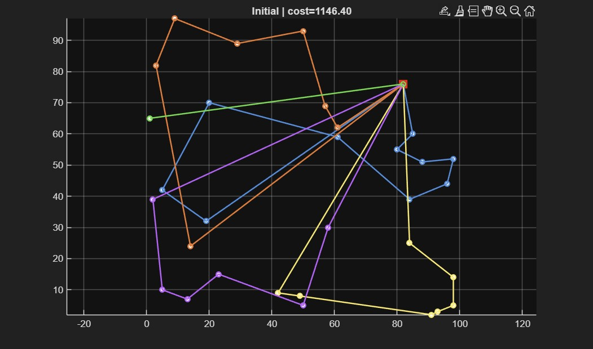
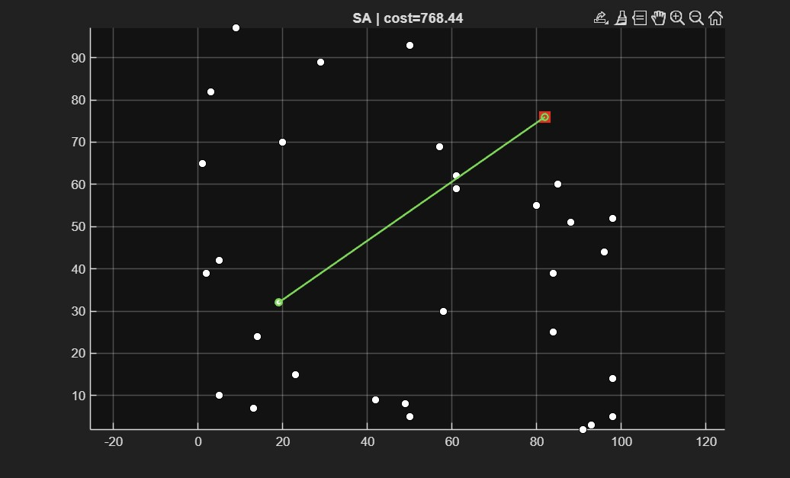
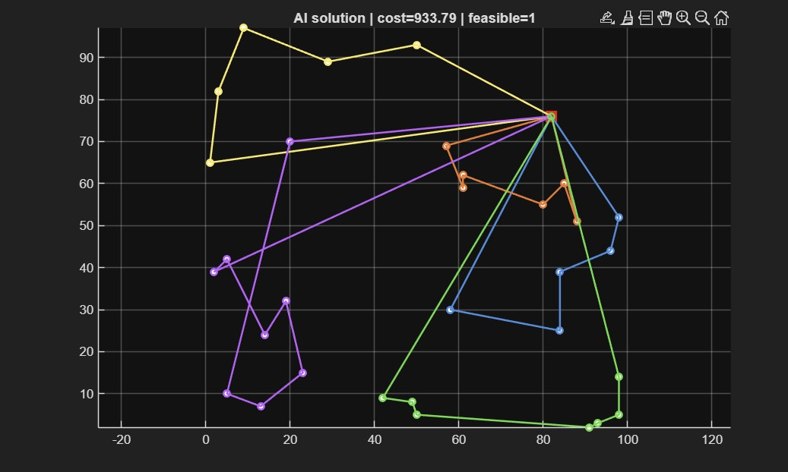

# Vehicle Routing Problem (CVRP) using MATLAB

This project presents a MATLAB implementation of the **Capacitated Vehicle Routing Problem (CVRP)**.

The objective is to determine the optimal routes for a fleet of vehicles while minimizing the total traveled distance and satisfying vehicle capacity constraints.

The project uses a **Greedy algorithm** to generate an initial feasible solution and then improves it using the **Simulated Annealing (SA)** metaheuristic.

---

# Features

- Read standard TSPLIB CVRP benchmark instances
- Compute Euclidean distance matrix
- Generate an initial solution using Greedy heuristic
- Optimize routes using Simulated Annealing
- Evaluate total travel distance
- Check route feasibility (capacity constraints)
- Plot vehicle routes
- Verify AI-generated solutions

---

# Algorithms

## Greedy Algorithm

The initial solution is generated by repeatedly selecting the nearest feasible customer while respecting the vehicle capacity.

Advantages:
- Very fast
- Always produces a feasible initial solution

Disadvantages:
- Usually far from the optimal solution

---

## Simulated Annealing (SA)

Simulated Annealing improves the greedy solution through neighborhood search.

Neighborhood operators used:

- Relocate
- Swap
- 2-Opt

The algorithm occasionally accepts worse solutions at high temperatures to escape local minima. As the temperature decreases, it gradually focuses on improving the solution.

---

# Project Structure

```
.
├── A-n32-k5.vrp                 Benchmark instance
├── AI.m                         AI verification script
├── ai_answer.txt                AI-generated routes
├── read_vrp_tsplib.m            TSPLIB reader
├── distmat_euc2d.m              Distance matrix computation
├── initial_greedy_cvrp.m        Greedy initial solution
├── sa_cvrp.m                    Simulated Annealing optimization
├── cvrp_cost.m                  Cost evaluation
├── plot_routes.m                Route visualization
├── verify_ai_solution.m         AI solution verification
├── run_vrp_A32.m                Main program
├── images/
│   ├── initial_solution.jpg
│   ├── sa_solution.jpg
│   └── ai_solution.jpg
└── README.md
```

---

# How to Run

Run the main optimization:

```matlab
run_vrp_A32
```

To verify an AI-generated solution:

```matlab
AI
```

---

# Results

## Initial Solution (Greedy)



Initial Cost

```
1146.40
```

---

## Optimized Solution (Simulated Annealing)



Optimized Cost

```
768.44
```

Gap from Best Known Solution

```
-1.98%
```

---

## AI Generated Solution



Computed Cost

```
933.79
```

The AI-generated routes satisfy:

- Vehicle capacity constraints
- Route structure validation
- Customer uniqueness

---

# Requirements

- MATLAB R2025a (or compatible version)

---

# Benchmark

Dataset:

```
A-n32-k5
```

Source:

TSPLIB Vehicle Routing Benchmark

---

# Author

**Pardis Eshghinejad**

Master's Student in Computer Engineering (Artificial Intelligence)

University of Genoa, Italy
